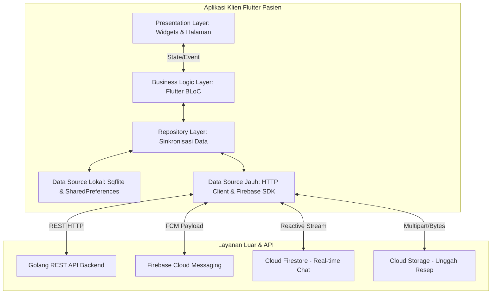
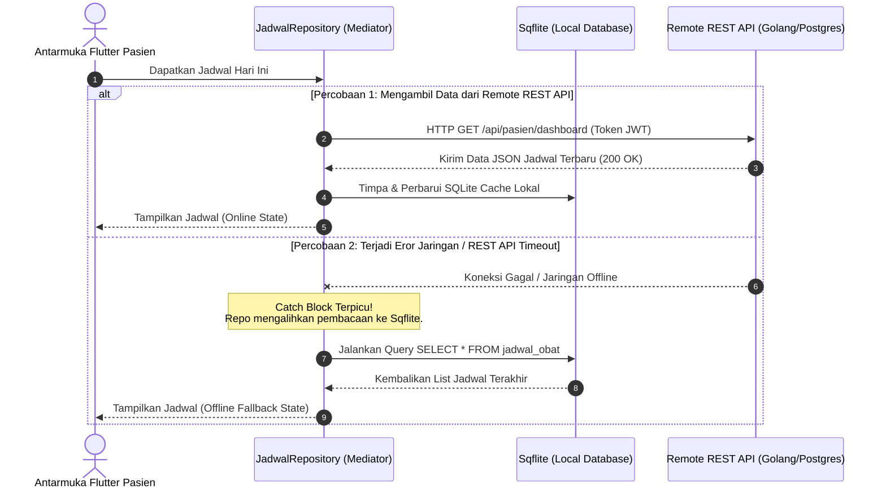

# 📑 DOKUMEN SPESIFIKASI ARSITEKTUR KLIEN: FLUTTER PASIEN
## 💊 Proyek: Pil-Time (Platform Kepatuhan Minum Obat & Pelacakan Kesehatan)

Dokumen teknis resmi ini menyajikan spesifikasi mendalam mengenai arsitektur, manajemen state, integrasi pihak ketiga, dan mekanisme luring (*offline-first*) yang diterapkan khusus pada aplikasi **klien mobile (Flutter Pasien)** di platform **Pil-Time**. Dokumen ini disusun sebagai panduan standar bagi tim pengembang seluler (*mobile developer*) dalam menjaga kualitas, skalabilitas, dan kemudahan pemeliharaan kode.

---

## 1. Overview Flutter Tech Stack & Ecosystem

Pengembangan aplikasi klien mobile **Pil-Time** didasarkan pada prinsip **kinerja tinggi, fluiditas visual, serta ketangguhan luring (*offline resilience*)**. Klien seluler dibangun menggunakan SDK **Flutter** dengan ekosistem pustaka (*packages*) terpilih untuk menjamin stabilitas fungsionalitas medis kritis.



### 1.1. Mengapa Flutter?
*   **Performa Native & Fluiditas UI**: Dukungan engine grafis modern (Impeller/Skia) di Flutter menjamin rendering antarmuka 60-120 FPS tanpa hambatan (*jank-free*), yang krusial untuk animasi halus pada dasbor kepatuhan obat dan transisi antar halaman.
*   **Single Codebase**: Memungkinkan satu basis kode Dart untuk dideploy ke Android dan iOS secara simultan, menghemat siklus pengujian dan penyelarasan fitur.
*   **Akses Fitur Sistem Operasi Tingkat Rendah**: Memiliki kompatibilitas tinggi dengan modul alarm perangkat keras (*alarm manager*), penjadwal tugas latar belakang (*background task scheduling*), GPS, serta notifikasi push lokal.

### 1.2. Pustaka Inti Ekosistem (*Core Packages*)
Berdasarkan berkas spesifikasi `pubspec.yaml`, berikut adalah pustaka pihak ketiga utama yang menopang arsitektur aplikasi:
*   `flutter_bloc` & `bloc`: Pengelola state utama untuk memisahkan logika bisnis dari antarmuka visual.
*   `shared_preferences`: Penyimpanan lokal bertipe kunci-nilai (*key-value*) untuk preferensi pengguna dan sesi JWT terenkripsi.
*   `geolocator` & `geocoding`: Akuisisi koordinat GPS berpresisi tinggi dan layanan penerjemahan koordinat menjadi alamat berstruktur (*reverse geocoding*).
*   `firebase_core` & `firebase_messaging`: Fondasi BaaS dan penanganan push notifikasi (*FCM*) real-time saat aplikasi berada di latar depan (*foreground*), latar belakang (*background*), maupun saat mati (*terminated*).
*   `flutter_local_notifications`: Pemicu notifikasi alarm lokal presisi tinggi agar alarm obat tetap berbunyi tepat waktu secara offline.
*   `http`: Penghubung komunikasi REST API HTTP client dengan backend server Golang.

---

## 2. State Management & Client Architecture (4-Layer Pattern)

Aplikasi klien **Pil-Time** menerapkan arsitektur bersih terstruktur dalam **4 Lapisan (4-Layer Client Architecture)**. Pola ini memisahkan tanggung jawab secara tegas (*separation of concerns*) untuk memudahkan proses pengujian unit (*unit testing*) dan pengembangan skala besar.

### 2.1. Visualisasi Alur Data Reaktif Flutter

```
┌────────────────────────────────────────────────────────┐
│               PRESENTATION LAYER (UI)                  │
│     - Halaman (Dashboard, Login, Detail Obat)          │
│     - Widget kustom (Custom buttons, form inputs)      │
└───────────────────────────┬────────────────────────────┘
                            │ (1) Memicu Event (misal: LoginSubmitted)
                            ▼
┌────────────────────────────────────────────────────────┐
│              BUSINESS LOGIC LAYER (BLoC)               │
│     - Menerima Event, Memetakan State Transition       │
│     - Memancarkan (emit) State baru ke Widget UI        │
└───────────────────────────┬────────────────────────────┘
                            │ (2) Memanggil fungsi di Repository
                            ▼
┌────────────────────────────────────────────────────────┐
│                  REPOSITORY LAYER                      │
│     - Bertindak sebagai 'Single Source of Truth'       │
│     - Mengoordinasi data dari Local DB & Remote API    │
└───────────────────────────┬────────────────────────────┘
                            │ (3) Mengakses Data Mentah
                            ▼
┌────────────────────────────────────────────────────────┐
│                  DATA SOURCE LAYER                     │
│     - Local: SqfliteHelper & SharedPreferences         │
│     - Remote: ApiService (HTTP) & Firebase SDK         │
└────────────────────────────────────────────────────────┘
```

### 2.2. Pembagian Peran Tiap Layer

1.  **Presentation Layer (UI)**:
    *   Widget Flutter murni yang bersifat deklaratif. UI mendengarkan perubahan state menggunakan `BlocBuilder` atau memantau aksi satu kali (seperti menampilkan *Snackbar*) via `BlocListener`.
    *   **Aturan**: Sama sekali tidak diperbolehkan menulis logika perhitungan medis, panggilan internet, atau manipulasi database di dalam kode Widget.
2.  **Business Logic Layer (BLoC)**:
    *   Pengelola state berbasis pola aliran (*Stream*). Kelas BLoC menerima masukan berupa objek `Event` dari UI, berinteraksi dengan Repository untuk mengambil data, lalu mengeluarkan objek `State` baru ke UI.
    *   **Contoh BLoC Utama**: `AuthBloc` (mengelola sesi masuk, daftar, ganti kata sandi, dan OTP), `JadwalBloc` (mengelola render daftar obat harian).
3.  **Repository Layer**:
    *   Kelas penghubung yang mengabstraksikan sumber data. Repository menyatukan entitas data lokal dan remote sehingga BLoC tidak perlu tahu dari mana data tersebut berasal.
    *   **Contoh Logika**: Menangani alur sinkronisasi; menyimpan data yang diambil dari REST API ke database Sqflite lokal agar dapat dibaca ketika offline.
4.  **Data Source Layer**:
    *   **Local Data Source**: Mengelola pembacaan/penulisan langsung pada database SQLite lokal perangkat (`sqflite`) dan penyimpanan kunci-nilai (`shared_preferences`).
    *   **Remote Data Source**: Melakukan panggilan REST API mentah menggunakan `http` client, serta memanipulasi *Firebase SDK* untuk sinkronisasi cloud.

### 2.3. Contoh Implementasi: Alur Reaktif Otentikasi (`AuthBloc`)

Berikut adalah struktur kode reaktif `AuthBloc` yang memetakan *event* menjadi status *state* visual pada aplikasi klien:

```dart
// file: lib/bloc/auth/auth_bloc.dart
import 'package:flutter_bloc/flutter_bloc.dart';
import '../../services/auth_service.dart';
import 'auth_event.dart';
import 'auth_state.dart';

class AuthBloc extends Bloc<AuthEvent, AuthState> {
  AuthBloc() : super(AuthInitial()) {
    on<AuthCheckRequested>(_onAuthCheckRequested);
    on<LoginSubmitted>(_onLoginSubmitted);
    on<LogoutRequested>(_onLogoutRequested);
  }

  // Pengecekan sesi saat aplikasi baru pertama kali dibuka
  Future<void> _onAuthCheckRequested(
    AuthCheckRequested event,
    Emitter<AuthState> emit,
  ) async {
    // Membaca sesi aktif dari Local Data Source (SharedPreferences)
    final session = await AuthService.getPasienSession();
    if (session != null && session['pasien_id'] != null) {
      emit(AuthAuthenticated(session: session));
    } else {
      emit(AuthUnauthenticated());
    }
  }

  // Logika login ketika pengguna menekan tombol Submit
  Future<void> _onLoginSubmitted(
    LoginSubmitted event,
    Emitter<AuthState> emit,
  ) async {
    emit(AuthLoading()); // UI akan langsung merender circular loading indicator
    try {
      // Melakukan POST Request ke Remote API Backend
      final result = await AuthService.login(
        email: event.email,
        password: event.password,
      );

      if (result['success'] == true) {
        final session = await AuthService.getPasienSession();
        emit(AuthAuthenticated(session: session!)); // Mengarahkan ke halaman Dashboard
      } else {
        emit(AuthFailure(error: result['error'] ?? 'Email atau password salah'));
      }
    } catch (e) {
      emit(AuthFailure(error: 'Terjadi kesalahan jaringan: ${e.toString()}'));
    }
  }

  // Proses logout pengguna
  Future<void> _onLogoutRequested(
    LogoutRequested event,
    Emitter<AuthState> emit,
  ) async {
    emit(AuthLoading());
    await AuthService.clearSession(); // Mengosongkan data sesi di lokal SharedPreferences
    emit(AuthUnauthenticated()); // Mengembalikan ke halaman Login Screen
  }
}
```

---

## 3. Authentication & Cloud Services (BaaS - Firebase SDK on Flutter)

Aplikasi klien Flutter **Pil-Time** memanfaatkan kekuatan **Firebase SDK** untuk menangani fungsionalitas reaktif awan (*reactive cloud services*) yang berjalan langsung di latar belakang gawai pasien.

```
                  ┌───────────────────────────────┐
                  │    Aplikasi Flutter Pasien    │
                  └───────────────┬───────────────┘
                                  │
         ┌────────────────────────┼────────────────────────┐
         ▼                        ▼                        ▼
┌──────────────────┐    ┌──────────────────┐    ┌──────────────────┐
│  Firebase Auth   │    │ Cloud Firestore  │    │  Firebase Cloud  │
│    (Klien SDK)   │    │   (Klien SDK)    │    │ Messaging (FCM)  │
├──────────────────┤    ├──────────────────┤    ├──────────────────┤
│ - Kelola Sesi    │    │ - Obrolan Chat   │    │ - Tangkap Notif  │
│ - Amankan Token  │    │   Reaktif        │    │ - Auto-Save      │
│ - Integrasi OTP  │    │ - Live Monitor   │    │   Offline Cache  │
└──────────────────┘    └──────────────────┘    └──────────────────┘
```

### 3.1. Firebase Authentication SDK
*   **Peran**: Menyediakan otentikasi siap pakai yang aman. Flutter SDK Firebase Auth menangani siklus hidup token autentikasi (*access & refresh token*) secara otomatis di balik layar, menghemat penggunaan memori dan meminimalisir kebocoran data sesi klien.
*   **Integrasi**: Berfungsi sebagai kredensial aman tambahan untuk mengakses Cloud Firestore dan Cloud Storage secara langsung dari klien mobile melalui aturan keamanan Firebase (*Security Rules*).

### 3.2. Cloud Firestore (Reactive Streams)
*   **Peran**: Digunakan secara intensif untuk mengelola **Fitur Konsultasi Chat Real-time** antara Pasien dan Tenaga Kesehatan (Nakes).
*   **Cara Kerja di Flutter**: Aplikasi klien menggunakan `Stream<QuerySnapshot>` untuk berlangganan (*subscribe*) pada koleksi data obrolan tertentu secara asinkron.
    ```dart
    // Contoh implementasi pembacaan chat reaktif di Flutter UI
    Stream<List<Message>> getChatMessages(String roomId) {
      return FirebaseFirestore.instance
          .collection('rooms')
          .doc(roomId)
          .collection('messages')
          .orderBy('timestamp', descending: true)
          .snapshots()
          .map((snapshot) => snapshot.docs
              .map((doc) => Message.fromJson(doc.data()))
              .toList());
    }
    ```
    Setiap kali dokter mengirim pesan melalui dashboard web, widget `StreamBuilder` di aplikasi Flutter Pasien akan mendeteksi data baru secara instan (sub-detik) tanpa memicu pemuatan ulang halaman (*reload*).

### 3.3. Firebase Cloud Messaging (FCM) & Push Notifications
*   **Peran**: Menangkap notifikasi penjadwalan obat baru yang dikirimkan oleh Nakes dari server backend.
*   **Siklus Hidup Notifikasi di Flutter**:
    1.  **Foreground State**: Saat aplikasi terbuka, notifikasi ditangkap oleh `FirebaseMessaging.onMessage.listen()`, yang kemudian memicu notifikasi lokal secara instan melalui `flutter_local_notifications` dan memperbarui cache Sqflite.
    2.  **Background/Terminated State**: Ditangani oleh *top-level function* `@pragma('vm:entry-point') Future<void> firebaseMessagingBackgroundHandler(RemoteMessage message)`. Fungsi ini berjalan di thread isolat Dart terpisah untuk menyimpan jadwal obat baru ke dalam cache SharedPreferences/SQLite lokal secara diam-diam dan menjadwalkan notifikasi alarm fisik pada sistem Android/iOS.

---

## 4. Location & Mapping Features

Fitur lokasi dirancang secara presisi di Flutter untuk memetakan keberadaan pengguna, melacak kunjungan Home Care Nakes, serta menampilkan lokasi apotek terdekat.

```
┌────────────────────────┐      ┌────────────────────────┐      ┌────────────────────────┐
│    Geolocator API      │ ───> │    Geocoding Engine    │ ───> │  Google Maps Flutter   │
├────────────────────────┤      ├────────────────────────┤      ├────────────────────────┤
│ Minta Izin & Dapatkan  │      │ Koordinat GPS ──>      │      │ Render Widget Peta,    │
│ Koordinat Koordinat    │      │ Alamat Manusia         │      │ Markers & Polylines    │
└────────────────────────┘      └────────────────────────┘      └────────────────────────┘
```

### 4.1. Geolocator (Sensor GPS & Izin Runtime)
*   **Peran**: Berinteraksi dengan sensor GPS internal pada gawai.
*   **Alur Logika**: Sebelum membaca lokasi, aplikasi menjalankan pengecekan layanan GPS (`isLocationServiceEnabled`) dan memeriksa izin aplikasi (`checkPermission`). Jika izin belum diberikan, Geolocator akan menampilkan dialog permintaan izin sistem secara dinamis (`requestPermission`).

### 4.2. Geocoding (Reverse Geocoding to Address)
*   **Peran**: Menerjemahkan koordinat lintang (*latitude*) dan bujur (*longitude*) yang diperoleh dari Geolocator menjadi string alamat berstruktur lengkap (Jalan, Kelurahan, Kecamatan, Kota, Kodepos) menggunakan plugin `geocoding`.

Berikut adalah kode wrapper layanan geospasial (`lib/services/location_service.dart`) yang diimplementasikan pada aplikasi klien:

```dart
// file: lib/services/location_service.dart
import 'package:geolocator/geolocator.dart';
import 'package:geocoding/geocoding.dart';

class LocationService {
  /// Mendapatkan alamat lengkap berbasis koordinat GPS saat ini di perangkat.
  static Future<String> getCurrentAddress() async {
    bool serviceEnabled;
    LocationPermission permission;

    // 1. Memeriksa apakah GPS hardware aktif
    serviceEnabled = await Geolocator.isLocationServiceEnabled();
    if (!serviceEnabled) {
      return Future.error('Layanan GPS perangkat dinonaktifkan.');
    }

    // 2. Mengelola runtime permission sistem operasi
    permission = await Geolocator.checkPermission();
    if (permission == LocationPermission.denied) {
      permission = await Geolocator.requestPermission();
      if (permission == LocationPermission.denied) {
        return Future.error('Izin lokasi ditolak oleh pengguna.');
      }
    }
    
    if (permission == LocationPermission.deniedForever) {
      return Future.error('Izin lokasi ditolak permanen. Aktifkan lewat pengaturan.');
    }

    // 3. Mengambil koordinat perangkat dengan tingkat akurasi tinggi
    Position position = await Geolocator.getCurrentPosition(
      desiredAccuracy: LocationAccuracy.high,
    );

    // 4. Konversi Reverse Geocoding
    try {
      List<Placemark> placemarks = await placemarkFromCoordinates(
        position.latitude,
        position.longitude,
      );

      if (placemarks.isNotEmpty) {
        Placemark place = placemarks[0];
        
        // Membangun format penulisan alamat Indonesia yang berstruktur
        String street = place.street ?? '';
        String subLocality = place.subLocality ?? ''; // Kelurahan
        String locality = place.locality ?? ''; // Kecamatan
        String subAdministrativeArea = place.subAdministrativeArea ?? ''; // Kota/Kabupaten
        String administrativeArea = place.administrativeArea ?? ''; // Provinsi
        String postalCode = place.postalCode ?? '';

        List<String> addressParts = [];
        if (street.isNotEmpty) addressParts.add(street);
        if (subLocality.isNotEmpty) addressParts.add(subLocality);
        if (locality.isNotEmpty) addressParts.add(locality);
        if (subAdministrativeArea.isNotEmpty) addressParts.add(subAdministrativeArea);
        if (administrativeArea.isNotEmpty) addressParts.add(administrativeArea);
        if (postalCode.isNotEmpty) addressParts.add('Kodepos $postalCode');

        return addressParts.join(', ');
      }
      return 'Alamat tidak ditemukan.';
    } catch (e) {
      return Future.error('Gagal memetakan koordinat ke alamat fisik: $e');
    }
  }
}
```

### 4.3. Google Maps Flutter Widget
*   **Peran**: Merender antarmuka peta interaktif langsung di dalam pohon widget Flutter.
*   **Fitur Pendukung**:
    *   **Penanda Kustom (*Custom Markers*)**: Memetakan ikon gambar kapsul/apotek pada titik koordinat apotek rujukan terdekat.
    *   **Rute Perjalanan (*Polylines*)**: Menggambar garis rute jalan raya secara real-time yang memandu dokter/perawat menuju rumah tinggal pasien ketika memesan layanan home care kesehatan.

---

## 5. Local Storage & Offline-First Networking Fallback

Keandalan peringatan minum obat pada jam yang telah ditentukan adalah aspek krusial. Oleh karena itu, arsitektur data pada aplikasi Flutter **Pil-Time** didesain menggunakan **Offline-First Networking dengan Intelligent Fallback Mechanism**.



### 5.1. Penyimpanan Lokal Perangkat (Sqflite vs SharedPreferences)

Aplikasi klien memilah penyimpanan lokal ke dalam dua jenis penyimpanan berdasarkan kompleksitas datanya:

| Fitur Penyimpanan | Sqflite (SQLite Lokal) | Shared Preferences (Key-Value) |
| :--- | :--- | :--- |
| **Kategori Data** | Data relasional transaksional bervolume besar. | Data preferensi sederhana dan penanda status singkat. |
| **Contoh Penggunaan** | Tabel `jadwal_obat` (salinan jadwal minum obat harian) dan tabel `riwayat_kepatuhan` (jurnal minum obat pasien). | Token JWT sesi aktif (`auth_token`), sesi singkat (`pasien_id`), dan penanda onboarding (`has_seen_onboarding`). |
| **Operasi Query** | Mendukung query kompleks seperti pencarian berfilter waktu `SELECT * FROM jadwal_obat WHERE waktu_minum = ?`. | Hanya mendukung operasi penulisan/pembacaan kunci tunggal `getString()`, `setInt()`, `setBool()`. |

### 5.2. Desain Offline Fallback & Sinkronisasi Antrian Data

Untuk memastikan data kepatuhan yang dicatat pasien saat dalam keadaan tidak ada internet (*offline*) tidak hilang, Flutter mengimplementasikan **Antrian Sinkronisasi Tertunda (*Pending Sync Queue*)**:

1.  **Optimistic UI Update & SQLite Log**:
    *   Setiap kali pasien menekan tombol "Sudah Minum Obat", aplikasi **selalu** menulis jurnal tersebut ke dalam database **Sqflite** terlebih dahulu dengan menyertakan bendera status `sync_status = 'pending_sync'`. Aplikasi langsung menampilkan tanda centang sukses pada antarmuka pengguna tanpa harus menunggu respon server.
2.  **Deteksi Koneksi Otomatis**:
    *   Aplikasi memanfaatkan sensor jaringan untuk memantau perubahan status konektivitas internet perangkat secara real-time.
3.  **Sinkronisasi Batch Otomatis**:
    *   Begitu mendeteksi perangkat kembali terhubung ke jaringan internet, *background worker* akan memproses antrian.
    *   Aplikasi membaca seluruh data baris di Sqflite yang memiliki status `pending_sync`, merangkainya ke dalam satu payload JSON batch, lalu mengirimkannya sekaligus ke endpoint API `/api/pasien/sync-kepatuhan`.
    *   Jika server merespon dengan kode `200 OK`, aplikasi lokal langsung mengubah bendera SQLite lokal menjadi `sync_status = 'synced'`. Hal ini menjamin konsistensi data antara database PostgreSQL pusat di server dan cache Sqflite di ponsel pasien.

---

### Ringkasan Pustaka Kunci Flutter Pil-Time

| Nama Pustaka | Peran Teknis dalam Aplikasi Klien | Keuntungan Utama untuk Proyek |
| :--- | :--- | :--- |
| `flutter_bloc` | Manajemen state terpusat untuk memisahkan UI dan logika. | Menghindari *race conditions*, kode rapi, sangat mudah diuji secara modular. |
| `firebase_messaging` | Penerimaan pesan push notifikasi jadwal baru (*FCM*). | Notifikasi real-time terintegrasi secara background di level OS. |
| `flutter_local_notifications` | Pemicu notifikasi alarm visual dan audio lokal. | Alarm obat terjamin 100% berbunyi tepat waktu meskipun gawai sedang offline. |
| `geolocator` | Akses sensor GPS gawai pasien/nakes. | Penentuan lokasi pasien presisi untuk kebutuhan peta & verifikasi home care. |
| `geocoding` | Reverse geocoding koordinat GPS menjadi alamat fisik. | Mempercepat pengisian form alamat tinggal pasien tanpa ketik manual. |
| `google_maps_flutter` | Widget rendering peta interaktif Google Maps. | Visualisasi lokasi apotek terdekat dan rute navigasi kunjungan Nakes. |
| `sqflite` | Database SQLite lokal terstruktur pada perangkat. | Menyimpan data log obat offline-first agar dasbor tetap terisi data. |
| `shared_preferences` | Penyimpanan key-value statis ringan di tingkat gawai. | Session persistence, token JWT tersimpan aman melintasi siklus restart aplikasi. |

---
*Dokumen teknis arsitektur Flutter ini dirancang sebagai panduan baku pengembangan aplikasi klien seluler **Pil-Time**. Penambahan modul atau perubahan struktur reaktivitas wajib dicatatkan melalui amandemen revisi dokumen ini.*
